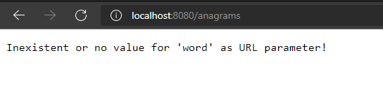
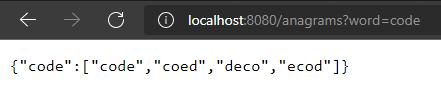
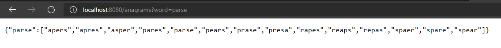
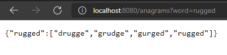

# anagram-web-service
### This is a lightweight web service which returns a JSON file with all valid English words anagrams to a given word.
Prerequisites: Stable version of Go https://go.dev/

Steps for building and testing the service:
* Open a terminal window
* Run 'go build .' from inside project directory to create the service executable on your local machine

**HINT**: You can start the included anagram_assignment.exe directly if your machine is running on Windows OS

* Start the service executable(anagram_assignment.exe or equivalent extension for your OS)
* Open your web browser of choice and visit http://localhost:8080/anagrams

Just so you know that you've done everything right up to this point, you should be prompted with this message

* Right after that you may complete the previous URL with your own word you wish to find anagrams for

**WARNING**: Keep in mind that it should follow the http://localhost:8080/anagrams?word=your_word pattern, replacing your_word with the given word

#### Examples

Anagrams for CODE:

Anagrams for PARSE:

Anagrams for RUGGED:

